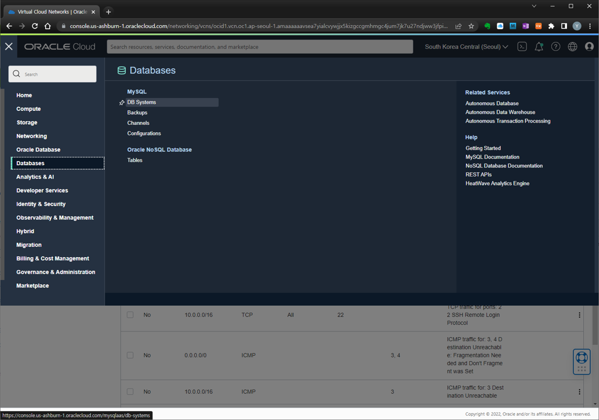
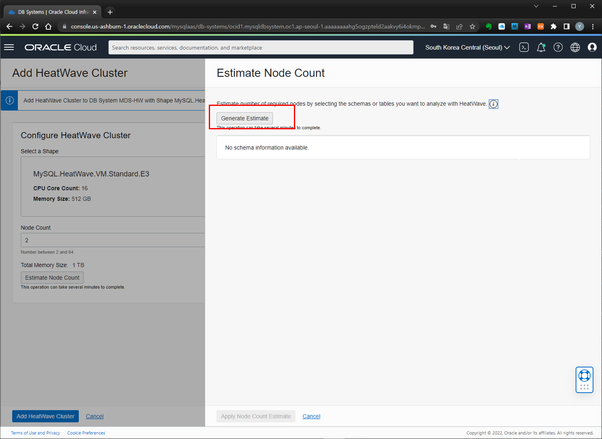
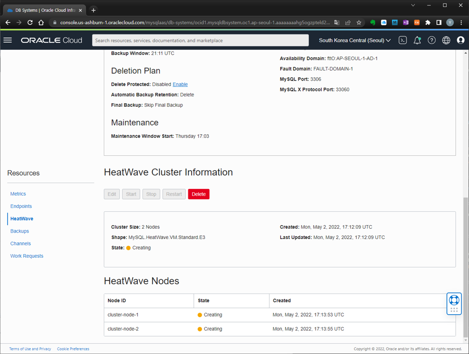

# Lab 3 : HeatWave Cluster 생성

- [Lab 3 : HeatWave Cluster 생성](#lab-3--heatwave-cluster-생성)
  - [Task 1 : Add a HeatWave Cluster to MDS-HW MySQL Database System](#task-1--add-a-heatwave-cluster-to-mds-hw-mysql-database-system)

MySQL DB System 에 HeatWave Cluster 를 생성하는 방법을 살펴보겠습니다.

## Task 1 : Add a HeatWave Cluster to MDS-HW MySQL Database System

1. Navigation Menu -> Databases -> MySQL DB Systems

     

2. **MDS-HW** 선택 

    

3. MDS-HW Detail Page -> More Action -> **Add HeatWave Cluster**

    

4. `Add HeatWave Cluster` 페이지에서 다음을 확인합니다.
    - Shape : **MySQL.HeatWave.VM.Standard.E3**
    - `Estimate Node Count` 클릭하여 AutoPilot 기능 중의 하나인 Auto Provisioning 기능을 살펴보겠습니다.

    

5. **Generate Estimate** 버튼을 클릭하여 HeatWave 메모리 사용량 예측 및 예상 HeatWave Cluster 노드 수를 확인해 보겠습니다.

    

6. HeatWave Cluster에 로딩을 원하는 스키마/테이블을 선택한 후 HeatWave Cluster 노드 수를 예측합니다.  airportdb를 선택하여 각 테이블 별 예상 메모리 사용량 정보 및 예상 노드 수 정보를 확인할 수 있습니다.  `Apply Node Count Estimate` 를 클릭합니다.

    

7. 다음의 정보를 확인합니다.
    - Shape : **MySQL.HeatWave.VM.Standard.E3**
    - Node Count : **2**
    - `Add HeatWave Cluster` 클릭

    

8.  MySQL Database System 정보 페이지에서 HeatWave Nodes 상태 확인

    

    생성이 완료된 후 2개의 HeatWave 노드가 Active 상태인 것을 확인합니다.

    

