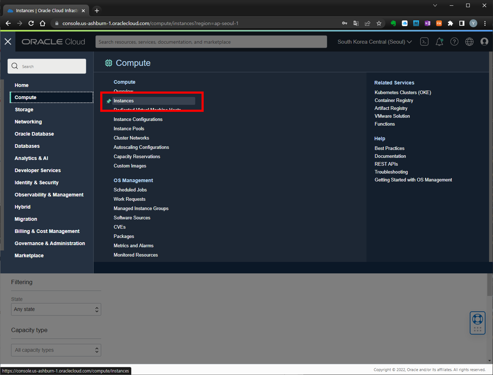

# Lab 2 : MySQL Database Service 에 접속 및 데이터 로드

- [Lab 2 : MySQL Database Service 에 접속 및 데이터 로드](#lab-2--mysql-database-service-에-접속-및-데이터-로드)
  - [Task 1 : MySQL Client(Bastion Host) 용으로 사용할 Compute Instance 생성](#task-1--mysql-clientbastion-host-용으로-사용할-compute-instance-생성)
  - [Task 2 : Compute Instance 환경 설정 및 MySQL Database Service 접속](#task-2--compute-instance-환경-설정-및-mysql-database-service-접속)
  - [Task 3 : MySQL 로 데이터 로딩](#task-3--mysql-로-데이터-로딩)
  - [(Optional) Task 4 : MySQL Workbench 설치 및 접속](#optional-task-4--mysql-workbench-설치-및-접속)


MySQL 데이터베이스 서비스는 Private Subnet 에 구성하여 공용 인터넷에서 바로 접속할 수가 없습니다.  Bastion 호스트라고 하는 Compute Instance를 구성하여 MySQL 데이터베이스 서브스와 접속합니다.  이 Compute Instance Bastion Host는 Private 리소스와 Private Network에 대한 액세스가 필요한 엔드포인트 사이에 위치하며 SSH와 같은 프로토콜을 통해 프라이빗 리소스에 로그인할 수 있도록 하는 "점프 박스" 역할을 합니다.  이 Bastion Host 에서 MySQL DB 시스템과 연결하기 위한 클라이언트를 설치하여 DB를 접속합니다.

MySQL DB 시스템에 접속 후 테스트 용 데이터를 로딩하는 작업을 수행합니다.

## Task 1 : MySQL Client(Bastion Host) 용으로 사용할 Compute Instance 생성

1. Navigation Menu -> Compute Instances

    
    
2. `Create Instance` 클릭

    

3. Create Compute Instance 페이지에서 다음의 정보를 입력합니다:
    - Name : **MDS-Client**
    - Compartment 선택 : MDS-Sandbox or User Compartment
    - Availability Domain : Default
    - Image : Default 
    - Shape 변경 : **VM.Standard.E2.2**
    - Networking : 
        + **MDS-VCN**
        + **Public Subnet-MDS-VCN
        + `Assign a public IP address` : **Yes**
    - Add SSH Keys: **Generate a key pair for me** 선택
        + **Save Private Key** 클릭 후 Private Key 파일( 파일명: `ssh-key-<date>.key` ) 저장
        + Public Key 파일도 저장 (추후 key pair 재사용을 위해 저장)
    - `Create` 클릭하여 생성

    
    
    

4. 생성된 Compute Instance 정보 페이지에서 **Public IP Address** 정보 확인 및 저장
    - Public IP Address = **146.56.167.33**

    
    

## Task 2 : Compute Instance 환경 설정 및 MySQL Database Service 접속

Compute Instance 접속을 위한 PC Client 는 putty, PowerShell (Windows), terminal 등 사용 가능합니다.  
본 문서에서는 Cloud Shell 을 사용하여 Compute Instance 접속하여 환경 설정을 수행하였습니다. 

1. **Cloud Shell** 수행 - 브라우저 우측 상단 Region 옆에 있는 터미널아이콘 클릭

    
    

2. 앞에서 저장한 Private Key 파일 복사
    - Private Key 파일( `ssh-key-<date>.key` )을 Cloud Shell 화면으로 Drop & Drop

    


3. [Cloud Shell] 에서 다음 수행 - Private Key 파일명은 테스트 환경에 맞게 수정합니다.
    
    ```
    cp ssh-key-2022-05-02.key .ssh/
    ```
    ```
    chmod 600 .ssh/ssh-key-2022-05-02.key
    ```

4. MDS-Client Compute Instance 접속 :  
   `$ ssh -i .ssh/ssh-key-<date>.key opc@<your_compute_instance_public_ip>` 명령을 사용하여 MDS-Client Compute Instance에 접속합니다.
    ```
    ssh -i .ssh/ssh-key-2022-05-02.key opc@146.56.167.33
    ```

    

5. MySQL Shell Client 를 설치합니다.

    ```
    sudo yum install mysql-shell -y
    ```

    

6. MySQL Database Service 접속  
    MySQL Database Service 상세 정보 페이지에서 Endpoint Private IP Address 정보 확인 (**10.0.1.251**)

    ```
    mysqlsh -uadmin -p -h 10.0.1.251 --sql
    ```

    MySQL 접속 후 다음을 수행하여 정상접속 여부를 확인합니다.

    ```
    show databases;
    \exit
    ```

    

<!--
    ```
    mysqlsh -uadmin -p -h 10.0.1.251 --sql
    Please provide the password for 'admin@10.0.1.251' : Oracle#1234
    MySQL Shell 8.0.28

    Copyright (c) 2016, 2022, Oracle and/or its affiliates.
    Oracle is a registered trademark of Oracle Corporation and/or its affiliates.
    Other names may be trademarks of their respective owners.

    Type '\help' or '\?' for help; '\quit' to exit.
    Creating a session to 'ADWML@10.0.1.251'
    Fetching schema names for autocompletion... Press ^C to stop.
    Your MySQL connection id is 1907 (X protocol)
    Server version: 8.0.28-u2-cloud MySQL Enterprise - Cloud
    No default schema selected; type \use <schema> to set one.
    MySQL 10.0.1.251:33060+ ssl SQL > show databases;
    +--------------------+
    | Database           |
    +--------------------+
    | information_schema |
    | mysql              |
    | performance_schema |
    | sys                |
    +--------------------+
    7 rows in set (0.0007 sec)

    MySQL 10.0.1.251:33060+ ssl SQL > \exit

    ```
-->

## Task 3 : MySQL 로 데이터 로딩

테스트용 데이터를 MySQL Database로 로딩합니다.

1. 테스트 용 데이터 파일을 다운로드합니다.  Cloud Shell 에서 다음을 수행합니다.

    ```
    
    wget -O airportdb.zip https://bit.ly/3K4B5W5
    unzip airportdb.zip
    ls airportdb
    
    ```

    

2. MySQL Database Service 에 접속하여 압축 해제한 데이터 파일을 로딩합니다.
    ```
    
    mysqlsh --mysql admin@10.0.1.251 --js
    Password : Oracle#1234
    
    ```
    MySQL Shell Client에서 util.loadDump 를 수행합니다.
    ```
    util.loadDump("/home/opc/airportdb", {dryRun: false, threads: 8, resetProgress:true, ignoreVersion:true})
    ```

    
   

3. 로딩 된 테이블 정보 확인
    ```
    -- sql mode 로 변경
    MySQL> \sql

    SELECT table_name, table_rows 
    FROM INFORMATION_SCHEMA.TABLES 
    WHERE TABLE_SCHEMA = 'airportdb';
    ```

    수행 결과
    ```
    MySQL  10.0.1.251:3306 ssl  JS > \sql
    Switching to SQL mode... Commands end with ;
    MySQL  10.0.1.251:3306 ssl  SQL > SELECT table_name, table_rows
                                    -> FROM INFORMATION_SCHEMA.TABLES
                                    -> WHERE TABLE_SCHEMA = 'airportdb';
    +----------------------------+------------+
    | TABLE_NAME                 | TABLE_ROWS |
    +----------------------------+------------+
    | airline                    |        113 |
    | airplane                   |       5583 |
    | airplane_type              |        315 |
    | airport                    |       9860 |
    | airport_geo                |       9993 |
    | airport_reachable          |          0 |
    | booking                    |   52061349 |
    | employee                   |       1000 |
    | flight                     |     461286 |
    | flight_log                 |          0 |
    | flightschedule             |       9952 |
    | passenger                  |      36208 |
    | passengerdetails           |      35137 |
    | supplementary_demographics |       4448 |
    | weatherdata                |    4606585 |
    +----------------------------+------------+
    ```

## (Optional) Task 4 : MySQL Workbench 설치 및 접속

https://www.mysql.com/products/workbench/ 페이지에서 MySQL Workbench dowonload 및 설치합니다.


설치 후 MySQL Workbench 수행 시 다음의 정보를 사용하여 MySQL DB를 접속합니다.
접속 방법은 **Standard TCP/IP over SSH** 방식을 통해 Bastion Compute 노드를 경유하여 MySQL DB 에 접속합니다.

- 입력 정보:
    - Connection Name : MySQL HetWave 
    - Connection Method : **Standard TCP/IP over SSH**
    - Parameters:
        + SSH Hostname : *Compute Instance Public IP* - 146.56.167.33
        + SSH Username : **opc**
        + SSH Key File : *SSH private key file*
        + MySQL Hostname : *MySQL Database Service Private IP* - 10.0.1.251
        + MySQL Username : admin
        + Default schema : airportdb
        + Test Connection 클릭 후 접속 확인

    

- Query Timeout 방지를 위한 Preference 설정
    + MySQL Workbench 메뉴 -> Edit -> Preferences..
    + SQL Editor 클릭
    + MySQL Session > DBMS Connection read timeout interval : 30 -> 600 으로 변경

    

- MySQL DB 접속 후 로딩된 테이블 정보 확인 SQL 수행 

    ```sql
    SELECT table_name, table_rows 
    FROM INFORMATION_SCHEMA.TABLES 
    WHERE TABLE_SCHEMA = 'airportdb';
    ```

    


