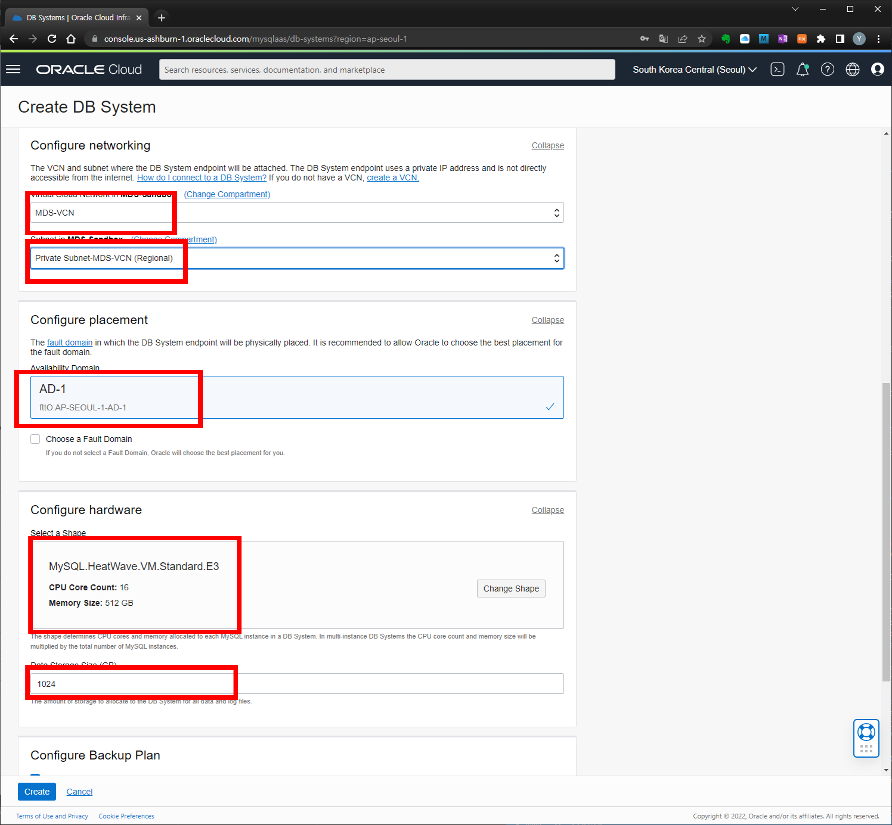

# Lab 1 : MySQL Database Service 생성

이 실습에서는 MySQL DB System을 생성하고 구성합니다.  MySQL Database Service를 생성하기 전 필요한 Virtual Cloud Network 환경 구성도 수행합니다.

- [Lab 1 : MySQL Database Service 생성](#lab-1--mysql-database-service-생성)
  - [Task 1 : Virtual Cloud Network 생성](#task-1--virtual-cloud-network-생성)
  - [Task 2 :  Create MySQL Database for HeatWave (DB System) instance](#task-2---create-mysql-database-for-heatwave-db-system-instance)

## Task 1 : Virtual Cloud Network 생성

1. **Navigation Menu** -> **Networking** -> **Virtual Cloud Networks**

    

2. **Start VCN Wizard** -> **Create VCN with Internet Connectivity** -> **Start VCN Wizard** 클릭

    

3. VCN 생성 화면에서 다음 정보 입력 후 Next 클릭:
    - VCN Name : **MDS-VCN**
    - Compartment : **지정된 Compartment 선택 ( ex. MDS-Sandbox or 사용자 Compartment)**

    

4. Review and Create 페이지 확인 후  `Create` 클릭:

    

5. VCN 생성 완료 확인 후 `View Virtual Cloud Network` 클릭:

    

6. 생성한 VCN(MDS-VCN) 정보 페이지 -> **Private Subnet-MDS-VCN** 클릭

    

7. **Security List for Private Subnet-MDS-VCN** 클릭

    

8. **Add Ingress Rules** 클릭

    

9.  Add Ingress Rules 페이지에서 다음 정보 입력하여 MySQL DB System 포트에 대한 접속을 허용한다.

    - Source CIDR : **0.0.0.0/0**
    - Destination Port Range : **3306,33060**
    - Description : **MySQL Port Access**

    

10. `Add Ingress Rules` 클릭 후 Security List for Private Subnet-MDS-VCN 페이지에서 추가한 Ingress Rule 정보 확인

    

위와 같이 VCN 생성 및 관련 구성 작업을 완료합니다.

## Task 2 :  Create MySQL Database for HeatWave (DB System) instance

1. Navigation Menu -> Databases -> MySQL DB Systems

    

2. Compartment 선택 후 **Create MySQL DB System** 클릭

    

3. MySQL DB System 생성 dialog 에 다음의 정보 입력
    - Compartment 선택 : MDS-Sandbox or User Compartment
    - Name : **MDS-HW**
    - Description : MySQL Database Service HeatWave instance
    - **HeatWave** 선택
    - Username : admin
    - Password : Oracle#1234
    - Configure Networking:
        + Virtual Cloud Network : **MDS-VCN**
        + Subnet: **Private Subnet-MDS-VCN (Regional)**
    - Configure Placement
        + Availability Domain : 디폴트 선택
        + `Choose a Fault Domain` 체크 박스 선택 안함
    - Configure Hardware
        + Shape: **MySQL.HeatWave.VM.Standard.E3**
        + Data Storage Size(GB) : **1024**
    - Configure Backup : `Enable Automatic Backup` 선택 안함
    - **Create** 클릭
  
    
    
    

4. MDS 생성 중

    

5. 생성 완료 후 MySQL DB Systems 정보 페이지의 **Endpoint** 정보에서 **Private IP Address** 정보 확인
    - Private IP Address = **10.0.1.251**
 
    

